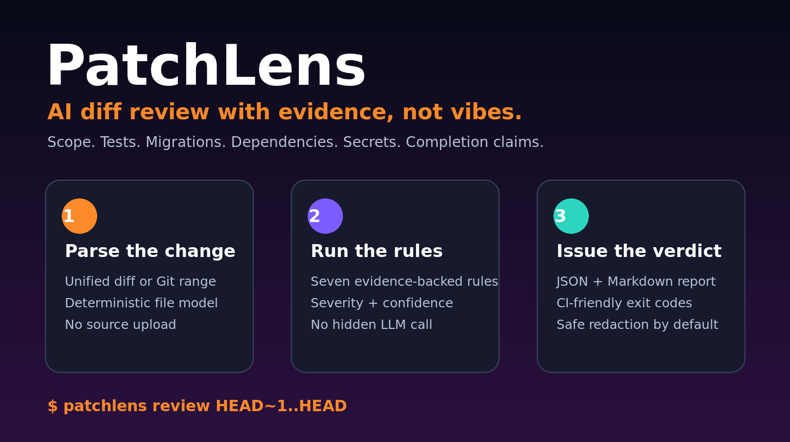

# PatchLens

<p align="center">
  
</p>

[](https://github.com/mturac/PatchLens/actions/workflows/ci.yml)
[](LICENSE)
[](package.json)
[](package.json)

**PatchLens reviews what a coding agent changed — not what it claims it changed.**

It parses a unified diff or Git range and produces deterministic, evidence-backed findings for the failure modes that repeatedly appear in vibe-coded changes:

- files changed outside declared scope;
- potential credentials added to a patch;
- source changes without test changes;
- schema/model changes without migrations;
- dependency manifest and lockfile drift;
- generated, vendor, build, or coverage files edited directly;
- patches that exceed a bounded review budget.

PatchLens is offline, has zero runtime dependencies, and makes no model calls. It is intentionally narrower than a full semantic code reviewer: rules are explicit, reproducible, and safe to run in CI.

## Quick start

Requirements: Node.js 22+ and Git.

```bash
git clone https://github.com/mturac/PatchLens.git
cd PatchLens
npm ci --ignore-scripts
npm run build
```

Review the latest commit:

```bash
node bin/patchlens.mjs review HEAD~1..HEAD \
  --repo . \
  --scope "src/**" \
  --scope "test/**" \
  --json-out .patchlens/review.json \
  --markdown-out .patchlens/review.md \
  --fail-on high
```

Review a saved patch:

```bash
git diff --binary HEAD~1..HEAD > change.diff
node bin/patchlens.mjs review change.diff --fail-on medium
```

Example result:

```text
Verdict       BLOCK
Files         12
Lines         +342 / -187
High          2
Medium        3
Low           0
Review hash   sha256:a901…7c2e
```

## Findings

| Code | Severity | Meaning |
|---|---|---|
| `PL201_SECRET_ADDITION` | high | An added line matched a credential/private-key detector; the value is redacted |
| `PL202_CODE_WITHOUT_TEST` | medium | Source code changed and no test/spec path changed |
| `PL203_SCOPE_ESCAPE` | high | A file changed outside the caller's declared path scope |
| `PL204_SCHEMA_WITHOUT_MIGRATION` | high | Schema/model/database surface changed without a migration path |
| `PL205_DEPENDENCY_CHANGE` | medium | A dependency manifest or lockfile changed |
| `PL206_GENERATED_EDIT` | medium | Generated, vendor, build, dist, or coverage output changed |
| `PL207_OVERSIZED_PATCH` | medium | The patch exceeded the configured file or line budget |

Every finding contains a code, severity, title, repository-relative path where applicable, and a bounded evidence statement. Secret findings never echo the matched value.

## CLI

```text
patchlens review <diff-file|git-range>
  [--repo <path>]
  [--scope <glob>]...
  [--json-out <review.json>]
  [--markdown-out <review.md>]
  [--fail-on <high|medium>]

patchlens inspect <review.json> [--json]
patchlens compare <before.json> <after.json> [--json] [--fail-on-change]
patchlens --version
patchlens --help
```

| Exit | Meaning |
|---:|---|
| `0` | Review completed and the requested gate passed |
| `1` | Invalid diff, unsupported binary patch, Git error, or operational failure |
| `2` | A requested severity or comparison gate failed |

## Review artifact

```json
{
  "schemaVersion": "1",
  "patch": {
    "hash": "sha256:…",
    "files": 12,
    "additions": 342,
    "deletions": 187
  },
  "findings": [
    {
      "code": "PL204_SCHEMA_WITHOUT_MIGRATION",
      "severity": "high",
      "title": "Schema changed without migration",
      "evidence": "A schema/model/database file changed but no migration path changed."
    }
  ],
  "summary": {
    "high": 2,
    "medium": 3,
    "low": 0,
    "verdict": "block"
  },
  "reviewHash": "sha256:…"
}
```

Identical diff text and review options produce identical file ordering, finding ordering, and review hash.

## CI comparison

Store a baseline review and detect newly introduced risk:

```bash
patchlens compare baseline.json candidate.json --fail-on-change
```

The comparison reports added and removed finding identities plus severity deltas. It does not compare hidden model opinions.

## Safety and limitations

PatchLens rejects Git binary patches. It does not execute changed code or fetch remote dependencies. It cannot prove semantic correctness, requirement coverage, runtime behavior, authorization safety, or production readiness.

Use PatchLens with:

- focused tests and type checks;
- InferShape for coding-agent session diagnosis;
- RepoPack for bounded task context;
- VibeProof for clean-clone and browser-level product proof;
- human review for business and architecture decisions.

## Library API

```ts
import {
  parseUnifiedDiff,
  reviewDiff,
  compareReviews,
  renderReviewMarkdown
} from "@mturac/patchlens";

const review = reviewDiff(diffText, {
  allowedPaths: ["src/**", "test/**"],
  maxChangedFiles: 40,
  maxChangedLines: 1200
});

if (review.summary.high > 0) process.exitCode = 2;
```

## Development

```bash
npm ci --ignore-scripts
npm run verify
```

Verification performs strict TypeScript compilation, CLI syntax checks, public API type-contract compilation, parser/rule/privacy/CLI tests, JSON Schema checks, PNG verification, and a real npm tarball consumer installation.

See [CONTRIBUTING.md](CONTRIBUTING.md), [SECURITY.md](SECURITY.md), and the [design specification](docs/superpowers/specs/2026-08-28-patchlens-design.md).

## License

Apache License 2.0. See [LICENSE](LICENSE) and [NOTICE](NOTICE).
